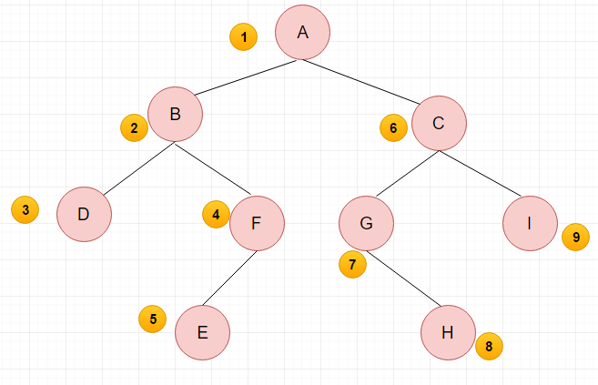
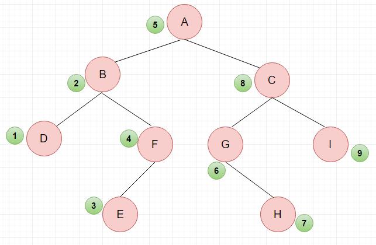
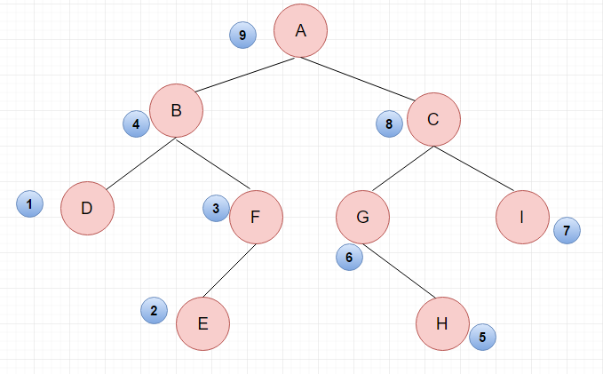

## 平台
牛客网

## 语言
python2.7.3

## 作业内容

### 题目描述
输入某二叉树的前序遍历和中序遍历的结果，请重建出该二叉树。
假设输入的前序遍历和中序遍历的结果中都不含重复的数字。
例如输入前序遍历序列 {1,2,4,7,3,5,6,8} 
     和中序遍历序列{4,7,2,1,5,3,8,6}，则重建二叉树并返回。

### 题目理解
[二叉树及其三种遍历](https://blog.csdn.net/qq_40772692/article/details/79343914)

#### 什么是二叉树

**满二叉树** 高度为 h，由 2^h-1 个节点构成的二叉树称为满二叉树。

**完全二叉树** 具有 n 个节点的完全二叉树的深度为 [log2n]+1，
其中 [log2n]+1 是向下取整。满二叉树的深度为 k=log2(n+1)

#### 二叉树的遍历形式

* 先序遍历：按照根节点 -> 左子树 -> 右子树

先序遍历：(1)访问根节点；(2)采用先序递归遍历左子树；(3)采用先序递归遍历右子树

#### **思维过程**：

(1)先访问根节点 A

(2)A 分为左右两个子树，因为是递归调用，所以左子树也遵循 “先根节点 - 再左 - 再右” 的顺序，所以访问 B 节点，

(3)然后访问 D 节点，

(4)访问 F 节点的时候有分支，同样遵循 “先根节点 - 再左 -- 再右” 的顺序,

(5) 访问 E 节点，此时左边的大的子树已经访问完毕，

(6) 然后遵循最后访问右子树的顺序，访问右边大的子树，右边大子树同样先访问根节点 C,

(7) 访问左子树 G,

(8) 因为 G 的左子树没有，所以接下俩访问 G 的右子树 H,

* 中序遍历：按照左子树 -> 根节点 -> 右子树的顺序访问

中序遍历：(1)采用中序遍历左子树；(2)访问根节点；(3)采用中序遍历右子树
* 后序遍历

后序遍历：(1)采用后序递归遍历左子树；(2)采用后序递归遍历右子树；(3)访问根节点；

### 解题思路
首先构建二叉树：

`class Node:  
    def __init__(self,value=None,left=None,right=None):  
        self.value=value  
        self.left=left    #左子树
        self.right=right  #右子树`

### 程序

### 补充知识点
