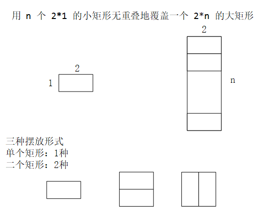

## 平台
牛客网

## 语言
python2.7.3

## 作业内容

### 题目描述
我们可以用 2*1 的小矩形横着或者竖着去覆盖更大的矩形。
请问用 n 个 2*1 的小矩形无重叠地覆盖一个 2*n 的大矩形，总共有多少种方法？

### 题目理解
本题的实质也是斐波那契数列

大矩形的n可以看成是1 2的相加。

### 解题思路
n=1 一种
n=2 2种
n=3 3种
n=4 5种

### 程序

    class Solution:
        def rectCover(self, number):
            if number <= 0:
                return 0
            if number == 1:
                return 1
            else:
                a, b = 1, 2
                for i in range(2,number):
                    a ,b =  b ,a+b
                return b

### 补充知识点
