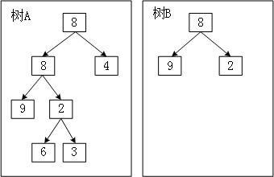

## 平台
牛客网

## 语言
python2.7.3

## 作业内容

### 题目描述
输入两棵二叉树 A，B，
判断 B 是不是 A 的子结构。
（ps：我们约定空树不是任意一个树的子结构）

### 题目理解

### 解题思路
1.对于二叉树B,确定其根节点
2.对于二叉树A,遍历每一层，找到与树B根节点相同的节点
3.遍历该节点下的子树，判断是否存在与树B结构相同的子树

### 程序

    class Solution:
        def HasSubtree(self, pRoot1, pRoot2):
            # write code here
            result = False
            if (pRoot1 == None) | (pRoot2 == None):
                return None
            else:
                result = self.isSubtree(pRoot1,pRoot2)
                if not result:
                    result = self.HasSubtree(pRoot1.left,pRoot2)
                if not result:
                    result = self.HasSubtree(pRoot1.right,pRoot2)
            return result
                 
                 
        def isSubtree(self,pRoot1,pRoot2):
            if (pRoot1 == None) & (pRoot2 != None):
                return False
            if pRoot2 == None:
                return True
            if pRoot1.val != pRoot2.val:
                return False
            return self.isSubtree(pRoot1.left,pRoot2.left) & self.isSubtree(pRoot1.right,pRoot2.right)

### 补充知识点
