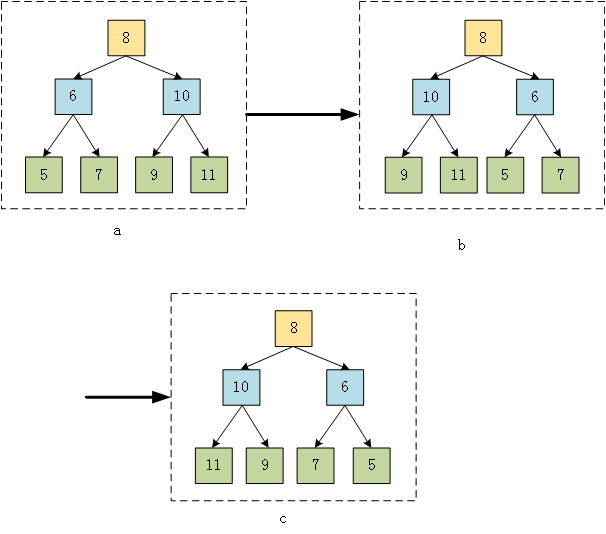

## 平台
牛客网

## 语言
python2.7.3

## 作业内容

### 题目描述
操作给定的二叉树，将其变换为原二叉树的镜像。

### 题目理解

### 解题思路
1.交换根节点下的左右节点，如a→b 

2.交换值为6的节点和值为10的节点的左右节点b→c

前序遍历这棵树的每个节点，遍历到的节点有子节点，这交换这两个子节点，直到交换玩所有的非子叶节点的左右节点

### 程序
    class Solution:
        # 返回镜像树的根节点
        def Mirror(self, root):
            # write code here
            if not root:
                return root
            if not root.right and not root.left:
                return root            
            if root.right or root.left:
                t=root.right
                root.right=root.left
                root.left=t
            self.Mirror(root.right)
            self.Mirror(root.left)
            return root

### 补充知识点
