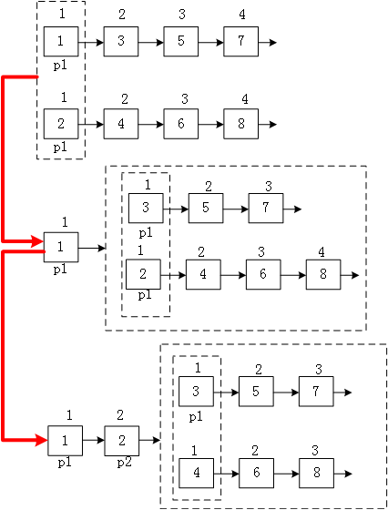

## 平台
牛客网

## 语言
python2.7.3

## 作业内容

### 题目描述
输入两个单调递增的链表，
输出两个链表合成后的链表，
当然我们需要合成后的链表满足单调不减规则。

### 题目理解

### 解题思路
1.对两个链表，比较它们的头节点，头节点小的即为合并之链表后的头节点

2.对与剩下的链表，比较他们的头节点，然后将头节点小的与之前合并链表的尾部连接起来

3.重复步骤2

### 程序
    class Solution:
        # 返回合并后列表
        def Merge(self, pHead1, pHead2):
            merge = None
            if pHead1 == None:
                return pHead2
            elif pHead2 == None:
                return pHead1
            if pHead1.val > pHead2.val:
                merge = pHead2
                pHead2 = pHead2.next
                merge.next = self.Merge(pHead1,pHead2)
            else:
                merge = pHead1
                pHead1 = pHead1.next
                merge.next = self.Merge(pHead1,pHead2)

### 补充知识点
