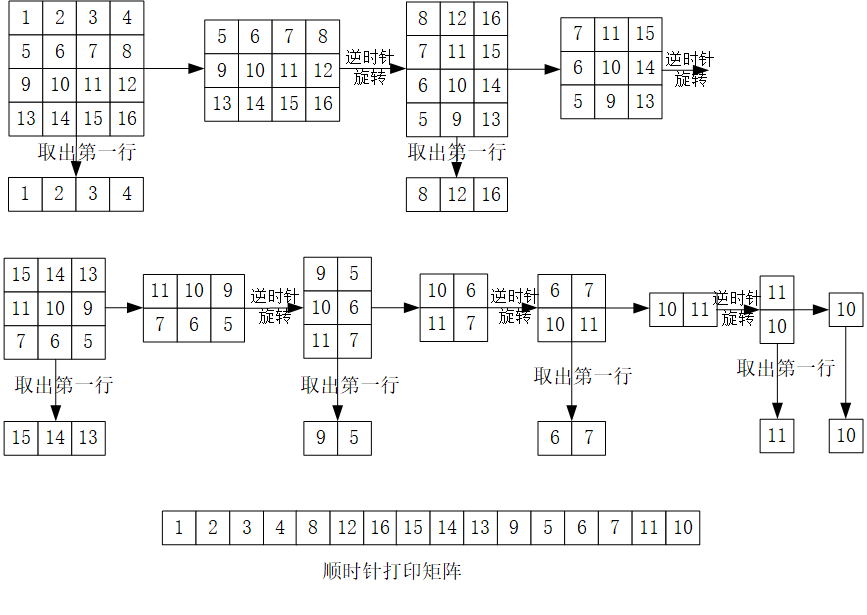

## 平台
牛客网

## 语言
python2.7.3

## 作业内容

### 题目描述
输入一个矩阵，按照从外向里以顺时针的顺序依次打印出每一个数字，

例如，如果输入如下4 X 4矩阵： 1 2 3 4 5 6 7 8 9 10 11 12 13 14 15 16 

则依次打印出数字1,2,3,4,8,12,16,15,14,13,9,5,6,7,11,10.

### 题目理解

### 解题思路
1. 输入矩阵
2. 判断矩阵是否为空。若为空，则结束。
3. 取出矩阵的第一行，添加到一个新的列表
4. 删掉矩阵的第一行，转置，生成新的矩阵
5. 跳到步骤2

### 程序

    # -*- coding:utf-8 -*-
    class Solution:
        # matrix类型为二维列表，需要返回列表
        def printMatrix(self, matrix):
            # write code here
            result = []
            while(matrix):
                result+=matrix.pop(0)#取第一行放入result，并删除第一行
                if not matrix or not matrix[0]:
                    break
                matrix = self.turn(matrix)
            return result
        def turn(self,matrix):
            num_r = len(matrix)
            num_c = len(matrix[0])
            newmat = []
            for i in range(num_c):
                newmat2 = []
                for j in range(num_r):#将j和i反过来，变为转置矩阵
                    newmat2.append(matrix[j][i])
                newmat.append(newmat2)
            newmat.reverse()#调换转置矩阵的顺序，变为魔方旋转
            return newmat

### 补充知识点
