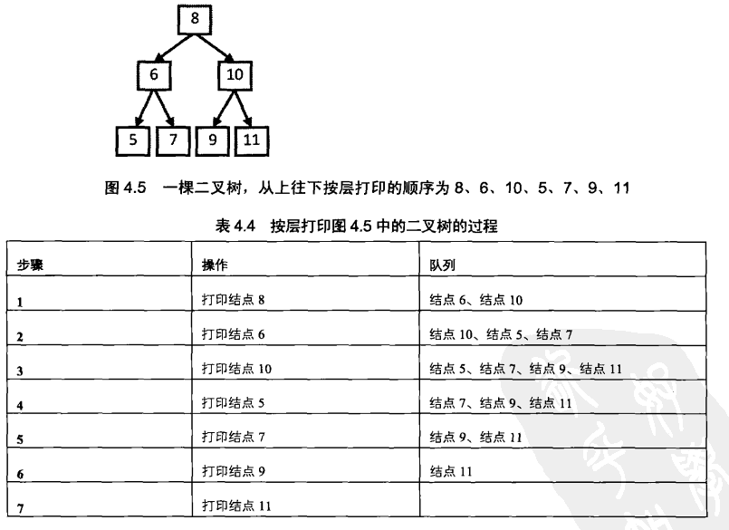

## 平台
牛客网

## 语言
python2.7.3

## 作业内容

### 题目描述

从上往下打印出二叉树的每个节点，同层节点从左至右打印。

### 题目理解

### 解题思路
1. 创建一个空队列，用来保存结点的值
2. 遍历二叉树的根结点，将根节点的值保存在队列中
3. 取出上一步根节点的值，将根节点下的子节点保存在队列
4. 重复第三步

### 程序

    class Solution:
        # 返回从上到下每个节点值列表，例：[1,2,3]
        def PrintFromTopToBottom(self, root):
            # write code here
            l=[]
            if not root:
                return []
            q=[root]
            while len(q):
                t=q.pop(0)
                l.append(t.val)
                if t.left:
                    q.append(t.left)
                if t.right:
                    q.append(t.right)
            return l 

### 补充知识点
